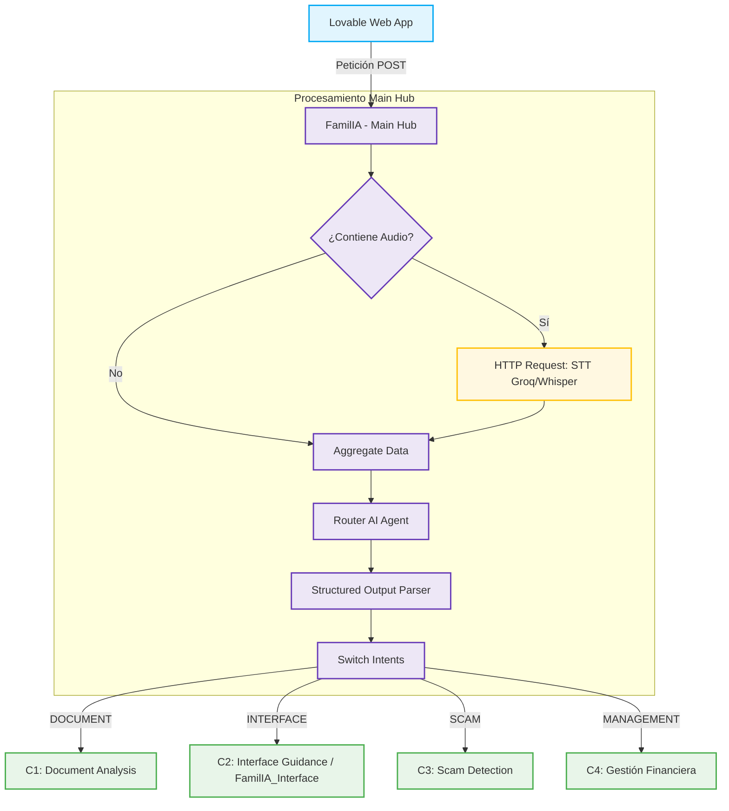
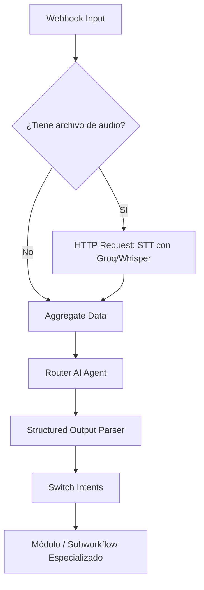
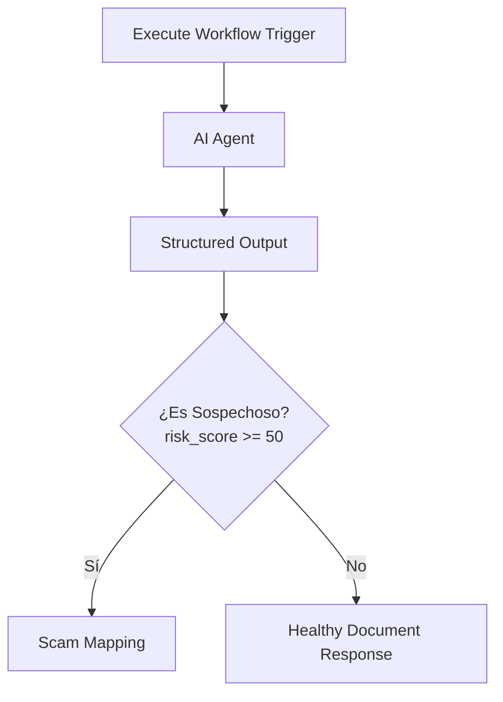
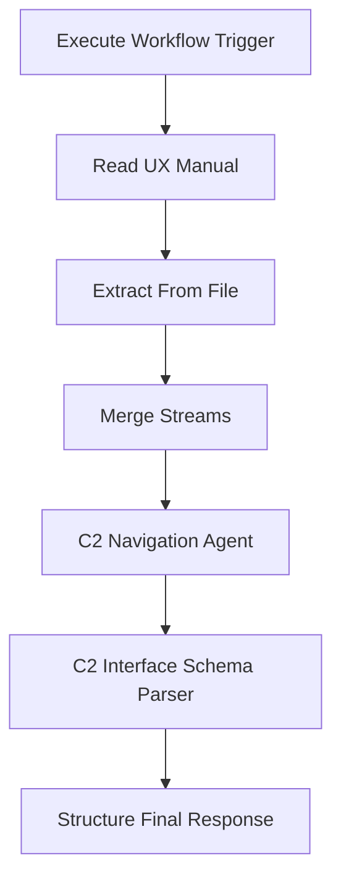
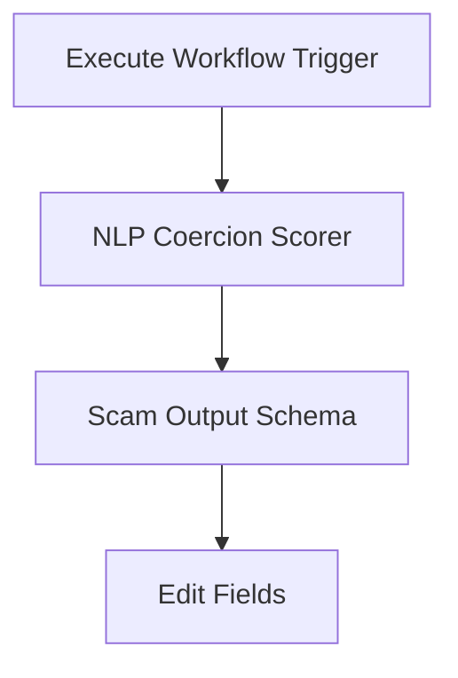
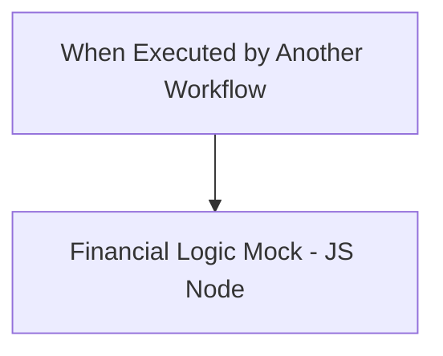

# 🤖 FamilIA — Documentación Técnica de Flujos n8n
### *Informe Final — Bloque Data Science & IA*

---

## 📋 Resumen Ejecutivo

> [!NOTE]
> La capa de automatización de **FamilIA** se ha construido en **n8n** siguiendo una arquitectura **Hub & Spoke**. El flujo principal recibe entradas de texto, audio e imagen desde la interfaz web de Lovable, normaliza la información y deriva la petición al módulo especializado correspondiente.
>
> Esta documentación detalla la lógica de cada flujo, su instalación, las pruebas funcionales, las limitaciones y los próximos pasos.

---

## ⚡ Elementos Clave del Sistema

| Elemento | Descripción |
| :--- | :--- |
| 🏗️ **Arquitectura** | Hub & Spoke con un *Main Hub* central y módulos (Spokes) especializados. |
| 🎙️ **Entradas Soportadas** | Procesamiento integrado de Texto, Audio e Imagen/Documento. |
| 🧩 **Módulos (Spokes)** | `C1 Document Analysis`, `C2 Interface Guidance`, `C3 Scam Detection` y `C4 Gestión Financiera`. |
| 📊 **Datos Financieros** | Dataset sintético/mock para evitar riesgos de privacidad en el MVP. |
| 🧪 **Validación** | Probado con éxito desde la web de Lovable con texto, audio e imagen. |

---

## 1. 🏗️ Arquitectura General

La arquitectura técnica de FamilIA se basa en **n8n** como capa de orquestación low-code. El objetivo es conectar la interfaz web con distintos módulos de IA y lógica financiera manteniendo una separación clara de responsabilidades.

El flujo principal recibe todas las peticiones y utiliza un enrutador para clasificar la intención en una de cuatro categorías: `DOCUMENT`, `INTERFACE`, `SCAM` o `MANAGEMENT`. A partir de esa clasificación, un nodo *Switch* envía la petición al subworkflow adecuado.

---

## 2. 📂 Inventario de Workflows

| Nombre del Workflow | Archivo en Repositorio | Función / Responsabilidad |
| :--- | :--- | :--- |
| **FamilIA - Main Hub** | [main_hub.json](file:///home/vinomo/programming/master/data_science_and_ai/familIA/backend/n8n/router/main_hub.json) | Orquestador central. Recibe texto, audio e imagen, normaliza el input y enruta la consulta. |
| **FamilIA - C1 Document Analysis** | [document_analysis.json](file:///home/vinomo/programming/master/data_science_and_ai/familIA/backend/n8n/spokes/document_analysis.json) | Analiza documentos e imágenes, extrae texto y evalúa el riesgo de estafa. |
| **FamilIA_Interface** | [interface.json](file:///home/vinomo/programming/master/data_science_and_ai/familIA/backend/n8n/spokes/interface.json) | Guía al usuario mayor dentro de interfaces bancarias a partir de capturas y un manual UX. |
| **FamilIA - C3 Scam** | [scam.json](file:///home/vinomo/programming/master/data_science_and_ai/familIA/backend/n8n/spokes/scam.json) | Detecta señales de estafa, presión o manipulación emocional en mensajes de texto. |
| **FamilIA - C4 Gestión Financiera** | [management.json](file:///home/vinomo/programming/master/data_science_and_ai/familIA/backend/n8n/spokes/management.json) | Responde consultas financieras mediante lógica determinista sobre datos sintéticos. |

---

## 3. 🧠 FamilIA - Main Hub

El **Main Hub** es el punto de entrada del sistema. Está configurado mediante un **Webhook POST** y responde únicamente cuando finaliza el último nodo, lo que evita que la web reciba una respuesta vacía antes de que el módulo seleccionado termine su ejecución.

### Flujo de Datos del Hub

### Componentes y Nodos del Hub

| Nodo | Función |
| :--- | :--- |
| **Webhook** | Recibe la petición desde Lovable. |
| **Audio file?** | Detecta si la entrada contiene un archivo de audio. |
| **HTTP Request (STT)** | Transcribe audio usando Groq/Whisper antes del enrutamiento. |
| **Aggregate Data** | Construye un payload común con `user_id` y `text`. |
| **Router AI Agent** | Clasifica la intención del usuario. |
| **Structured Output Parser** | Obliga al router a devolver una categoría válida. |
| **Switch Intents** | Deriva la consulta al módulo adecuado. |

---

## 📄 4. C1: Document Analysis

Este módulo analiza imágenes o documentos financieros. Extrae el texto visible y calcula una puntuación de riesgo. Si el documento no es sospechoso, genera una explicación sencilla; si detecta riesgo, devuelve una evaluación detallada orientada a prevenir fraudes.

### Flujo de Decisión de C1

### Campos de Salida del Esquema (Output Schema)

| Campo de Salida | Descripción |
| :--- | :--- |
| `extracted_text` | Texto extraído de la imagen/documento mediante OCR. |
| `risk_score` | Puntuación de riesgo en escala de `0` a `100`. |
| `easy_explanation` | Explicación sencilla cuando no hay riesgo alto detectado. |
| `brief_explanation` | Resumen breve de la alerta cuando hay riesgo alto. |
| `user_defense_guidance` | Recomendación clara y accionable para la autodefensa del usuario. |
| `coercion_tactics` | Tácticas de presión o manipulación detectadas (ej. urgencia, autoridad). |

---

## 📱 5. FamilIA_Interface (C2)

Este flujo ayuda a reducir la brecha digital en personas mayores. Recibe una captura de pantalla y una consulta del usuario, combina esa información con un manual de navegación y devuelve **únicamente el siguiente paso físico inmediato** que debe realizar el usuario.

### Lógica del Workflow

> [!IMPORTANT]
> **Dependencia de Archivo Local:**
> El flujo lee el archivo local `/home/node/.n8n-files/bbva_manual_en.md`. Para reproducirlo en otro entorno, es necesario subir el manual a esa ruta o modificar el nodo **Read UX Manual** en el flujo.

---

## 🛡️ 6. C3: Scam Detection

El módulo **C3** evalúa mensajes potencialmente fraudulentos o coercitivos. Está diseñado para ofrecer una respuesta breve, tranquila y adaptada al perfil senior. El prompt del agente de IA limita explícitamente lo que el asistente puede afirmar, evitando prometer acciones que el MVP no realiza (como bloquear pagos o contactar con el banco).

### Lógica del Workflow

### Campos de Salida del Esquema (Output Schema)

| Campo | Descripción |
| :--- | :--- |
| `risk_score` | Puntuación de riesgo de `0` a `100`. |
| `risk_level` | Nivel de riesgo cualitativo (`BAJO`, `MEDIO` o `ALTO`). |
| `brief_explanation` | Explicación directa en una sola frase. |
| `user_defense_guidance` | Guía de protección recomendada en un máximo de dos frases. |
| `coercion_tactics` | Lista de tácticas de coacción detectadas. |

---

## 💵 7. C4: Gestión Financiera

A diferencia de los otros módulos, el flujo **C4** responde a consultas financieras utilizando **lógica determinista escrita en JavaScript**. Al trabajar sobre un dataset sintético/mock, se elimina por completo el riesgo de alucinación en cálculos matemáticos, importes y duplicados.

### Estructura de Consulta

### Lógica de Respuestas para Consultas Sintéticas

| Consulta del Usuario | Resultado Esperado de la Simulación |
| :--- | :--- |
| **¿Me ha llegado la pensión?** | Devuelve el ingreso de pensión por un valor de **980,00 €**. |
| **¿Cuánto he gastado en supermercado?** | Devuelve un total de **79,20 €** y registros asociados `T003`/`T006`. |
| **¿Cuánto he gastado en farmacia?** | Devuelve **56,75 €** y una alerta de posible cobro duplicado. |
| **¿Tengo comisiones?** | Devuelve el total de comisiones acumuladas y una alerta de comisión inusual. |
| **¿Cuánto dinero tengo?** | Devuelve el último saldo disponible de **2.095,35 €**. |

> [!TIP]
> **Control de Cambios (GitHub version):**
> La versión preparada para GitHub incluye una corrección en la condición de recibo de luz: se utiliza explícitamente la cadena `"recibo de luz"` en lugar de clasificar cualquier uso genérico de `"recibo"` como electricidad.

---

## ⚙️ 8. Instalación y Uso de los Workflows

Sigue estos pasos ordenados para montar los flujos en tu entorno de n8n:

1. **Importar Subworkflows:** Importa primero los módulos dependientes:
   * `C4 Gestión Financiera` (`management.json`)
   * `C3 Scam Detection` (`scam.json`)
   * `C1 Document Analysis` (`document_analysis.json`)
   * `FamilIA_Interface` (`interface.json`)
2. **Importar Orquestador:** Importa el flujo principal `FamilIA - Main Hub` (`main_hub.json`).
3. **Credenciales:** Configura manualmente las credenciales de API para **Gemini** y **Groq** en n8n.
4. **Validación de Subworkflows:** Revisa que los nodos *Execute Workflow* del workflow principal `Main Hub` apunten de forma correcta a cada uno de los subworkflows importados en el paso 1.
5. **Configuración de Manuales:** Sube el manual de UX requerido por `FamilIA_Interface` en la ruta `/home/node/.n8n-files/bbva_manual_en.md` o edita el nodo correspondiente para usar una ruta alternativa.
6. **Activar Webhook:** Activa el workflow `FamilIA - Main Hub` en n8n y copia la URL de producción (*Production URL*) del webhook.
7. **Configuración en Frontend:** Pega la URL del webhook en el backend/configuración de la web de Lovable.
8. **Prueba General:** Realiza pruebas enviando texto, audio e imagen desde la interfaz final de usuario.

---

## 🧪 9. Plan de Pruebas Funcionales

| Caso | Input (Entrada) | Ruta Esperada (Workflow Path) | Resultado Esperado en el Frontend |
| :--- | :--- | :--- | :--- |
| **T01** | ¿Cuánto he gastado en supermercado? | `Main Hub` ➡️ `C4` | Total acumulado de **79,20 €**. |
| **T02** | ¿Me ha llegado la pensión? | `Main Hub` ➡️ `C4` | Mensaje indicando que la pensión fue recibida correctamente. |
| **T03** | Me piden un Bizum urgente... | `Main Hub` ➡️ `C3` | Nivel de riesgo **ALTO** y una recomendación segura para el usuario. |
| **T04** | *[Audio]* Consulta financiera | `Main Hub` ➡️ `STT` ➡️ `C4` | Transcripción en pantalla y respuesta determinista de saldo/gastos. |
| **T05** | *[Imagen]* Documento sospechoso | `Main Hub` ➡️ `C1` | Extracción de texto y evaluación detallada del riesgo de estafa. |
| **T06** | *[Imagen]* Captura de app bancaria | `Main Hub` ➡️ `Interface` | Indicación clara del siguiente paso físico inmediato a realizar en la app. |
